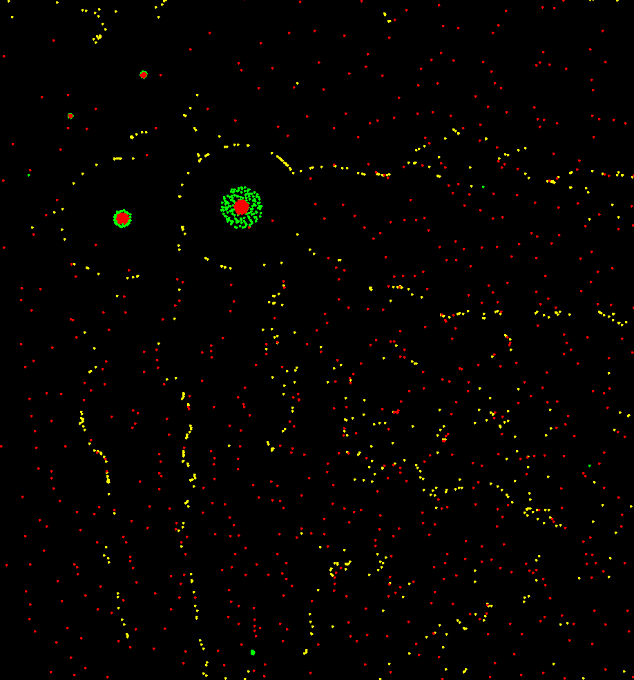
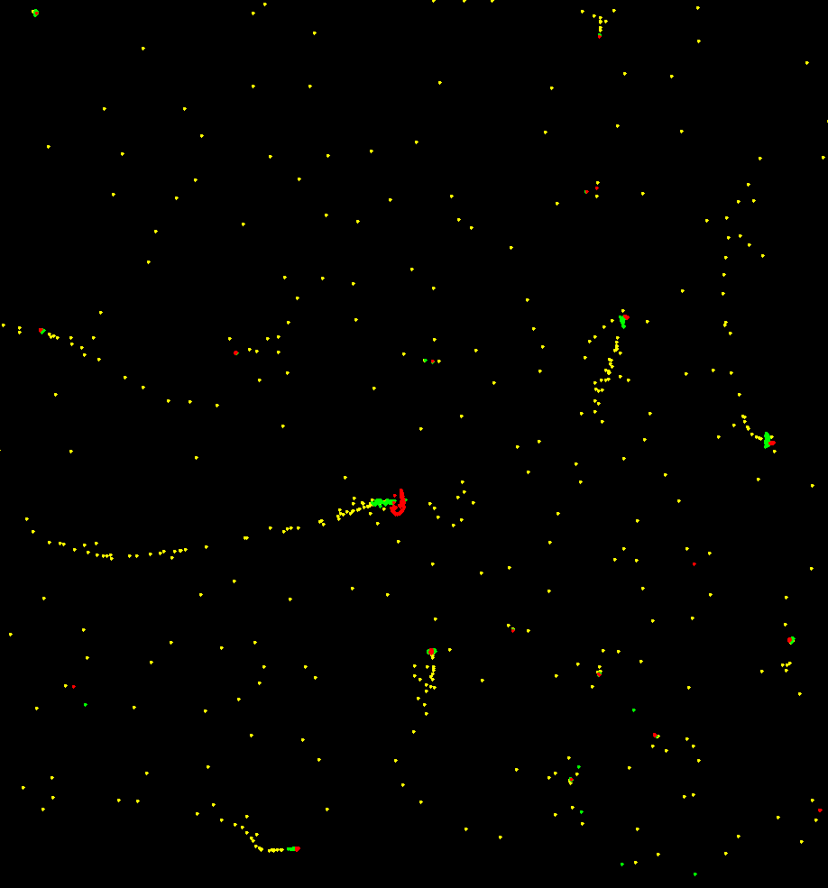

# particle simulation written in c for windows and linux

the system uses sdl 2 to draw simple circles as particles that have two forces
implemented ( with the gravity formula f = G/d^2)

- if G is positive it applys an **attraction**
- if G is negetive it applys an **repulsion**

<p float="left">
  
  
</p>

## how to build and run

just run:

```
make
make run
```

### TODO:

- [ ] fix wall collision checking in fast particle speeds
